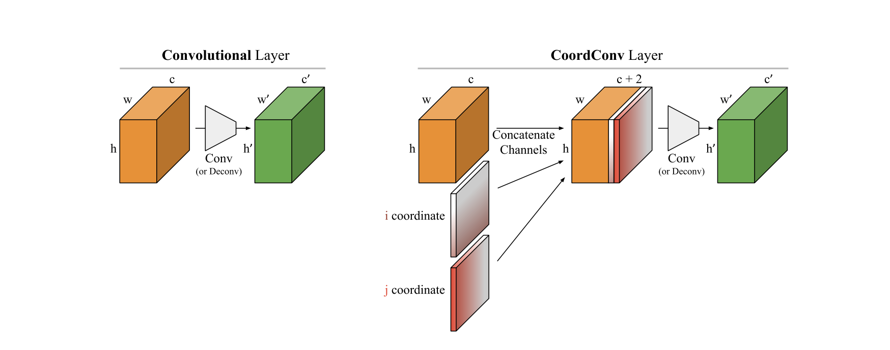

# Coord Conv 

Recently Uber claiming the conceived a brillian major modification on convolutional layer. The improvement on problem set like obj detection and deep RL is significant (especially if obj's position in you task is a critical info). Because the original convolution filter is translation invariant (not sensitive to position in the grid map)



### So, coord conv comes to rescue:

Original [very awesome post here](https://eng.uber.com/coordconv/), they even made a video about it.

Here is the pytorch deployment of coord conv module.


The core pytorch code could be as short as the following:

```python
bs,ch,h,w = x.size()
h_coord = torch.range(start = 0,end = h-1).unsqueeze(0).unsqueeze(0).unsqueeze(-1).repeat([bs,1,1,w])/(h/2)-1
w_coord = torch.range(start = 0,end = w-1).unsqueeze(0).unsqueeze(0).unsqueeze(0).repeat([bs,1,h,1])/(w/2)-1
return torch.cat([x,h_coord,w_coord],dim=1)
```
The complete nn module is like following
```python
import torch

class add_coord(nn.Module):
    def __init__(self):
        super(add_coord,self).__init__()
        
    def forward(self,x):
        bs,ch,h,w = x.size()
        h_coord = torch.range(start = 0,end = h-1).unsqueeze(0).unsqueeze(0).unsqueeze(-1).repeat([bs,1,1,w])/(h/2)-1
        w_coord = torch.range(start = 0,end = w-1).unsqueeze(0).unsqueeze(0).unsqueeze(0).repeat([bs,1,h,1])/(w/2)-1
        return torch.cat([x,h_coord,w_coord],dim=1)
    
class Coord2d(nn.Module):
    def __init__(self,in_channels,out_channels,kernel_size,stride=1,padding=0,dilation=1,groups=1,bias=True):
        """
        Coord Convolution Module
        Coord2d(in_channels,out_channels,kernel_size,stride=1,padding=0,dilation=1,groups=1,bias=True)
        Use it just like using a normal pytorch nn.Module
        """
        super(Coord2d,self).__init__()
        self.add_coord = add_coord()
        self.conv = nn.Conv2d(in_channels=in_channels+2,
                              out_channels=out_channels,
                              kernel_size=kernel_size,stride=stride,padding=padding,dilation=dilation,groups=groups,bias=bias)
        
    def forward(self,x):
        x = self.add_coord(x)
        for i in range(5):
            x = self.ln1(x)
        x = self.conv(x)
        return x
```

From now on, you can use coord conv as simple as you use any nn.Module in pytorch


### Intuitive understanding of coord value

```python
import torch
x = torch.rand(64,3,320,320)
bs,ch,h,w = x.size()
h_coord = torch.range(start = 0,end = h-1).unsqueeze(0).unsqueeze(0).unsqueeze(-1).repeat([bs,1,1,w])/(h/2)-1
w_coord = torch.range(start = 0,end = w-1).unsqueeze(0).unsqueeze(0).unsqueeze(0).repeat([bs,1,h,1])/(w/2)-1
coord = torch.cat([h_coord,w_coord],dim=1)
```


```python
coord[0,:,0,0]
```


    tensor([-1., -1.])


```python
coord[0,:,0,-1]
```


    tensor([-1.0000,  0.9937])


```python
coord[0,:,-1,0]
```


    tensor([ 0.9937, -1.0000])


```python
coord[0,:,int(320/2),int(320/3)]
```


    tensor([ 0.0000, -0.3375])


